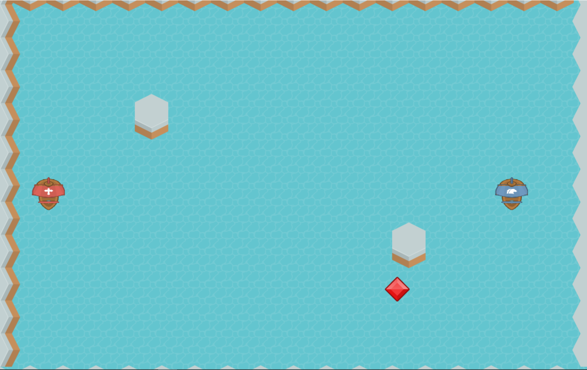

DJ's Pirate-Game

This is my EW000 final project game.

In this head-to-head battle between you and your friend, two pirate ships will fight to the death.

On the left is Pirate ship 1, and on the right is Pirate ship 2.

Both ships have the same capabilities and the same health of 3.

You can gain health by going over a power-up but be careful, you don't want to run into the islands because you will die if you are at full health, but if you are not at full health, nothing will happen. If you get hit by a cannonball you only lose 1 health.

Pirate ship 1: This pirate ship is controlled by WASD keys. "W, S" control forward and backward movement, and "A, D" control which way the ship rotates. "Q" is used to fire the cannon.

Pirate ship 2: This pirate ship is controlled by Arrow keys. "UP, DOWN" arrows control forward and backward movement, and "LEFT, RIGHT" control which way the ship rotates. "SHIFT" is used to fire cannon.
When a ship wins, click on the mouse to exit the game.

Use the spacebar to start the game when it loads.

If you want more powerups to spawn use the spacebar!
